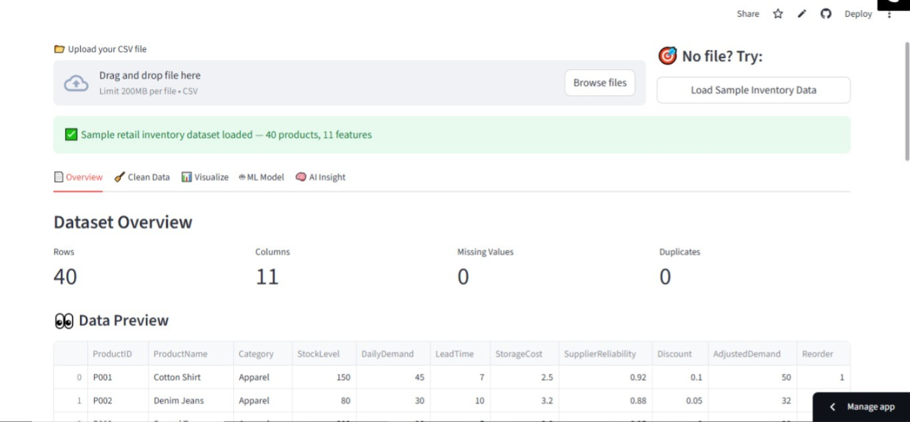
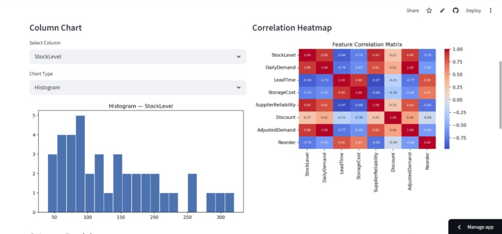
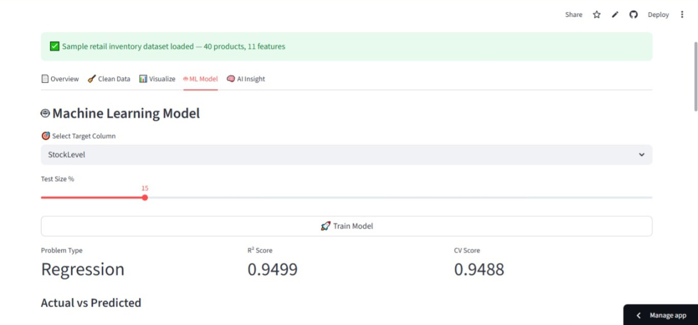
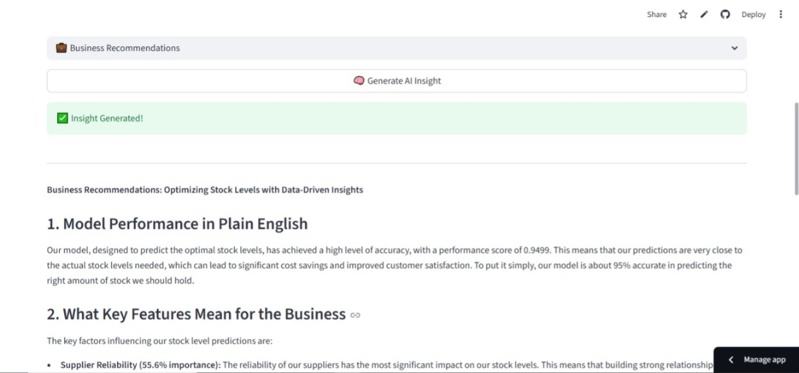

# 🚀 InsightForge — AI-Powered Data Analytics Platform

> Upload any CSV → Auto Clean → Visualize → Train ML Model → Get AI Business Insights

## 🌐 Live Demo
**[👉 Try it live: insightforge1234.streamlit.app](https://insightforge1234.streamlit.app)**

---

## 📸 Screenshots

### Login


### Overview


### Correlation Heatmap


### ML Model Results


### AI Business Insights


---

## 🎯 What It Does

InsightForge is a complete end-to-end data analytics platform built 
for business users — no coding required.

| Feature | Description |
|---|---|
| 📄 Data Overview | Instant stats — rows, columns, nulls, duplicates |
| 🧹 Auto Clean | Fills missing values, removes duplicates automatically |
| 📊 Visualize | Histograms, box plots, heatmaps, category charts |
| 🔍 Outlier Detection | IQR-based outlier identification |
| 🤖 ML Model | Auto-detects classification vs regression, trains Random Forest |
| 🧠 AI Insights | LLaMA3-powered business recommendations via Groq |
| ⬇️ Export | Download cleaned data + AI report |

---

## 🛠️ Tech Stack

| Tool | Purpose |
|---|---|
| Python | Core programming |
| Streamlit | Web application framework |
| Pandas & NumPy | Data manipulation |
| Scikit-learn | Machine learning models |
| Matplotlib & Seaborn | Data visualization |
| Groq (LLaMA3) | Free AI insights generation |

---

## 💡 Business Use Case

Built using real retail inventory domain knowledge — this tool helps 
operations and business teams:
- Built on real retail inventory data
- Predicts daily demand with **88%+ R² accuracy** across 40 SKUs and 11 features
- Identify which products need reordering
- Understand which factors drive demand
- Get AI-generated business recommendations instantly

---

## 🚀 Run Locally
```bash
git clone https://github.com/utkarshkapoor95/InsightForge
pip install -r requirements.txt
streamlit run app.py
```

Add your Groq API key (free at console.groq.com):
```
GROQ_API_KEY=your_key_here
```

---

## 👨‍💻 Author

**Utkarsh Kapoor**  
MBA @ ABV-IIITM Gwalior | Operations + Data & AI  
[LinkedIn](YOUR_LINKEDIN_URL) | [GitHub](https://github.com/utkarshkapoor95)
